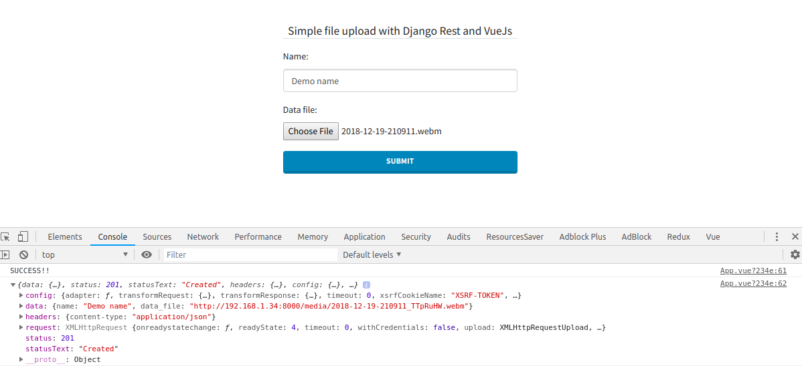

### File upload with django-rest and vuejs

1. Run backend/server in background

```
cd rest_fileupload/
docker-compose up -d

# server will be live on http://127.0.0.1:8000
```

2. Run frontend

```
cd rest-fileupload-ui
npm i
npm run serve

# client will be live on http://127.0.0.1:8080
```

3. Sample screen shot


